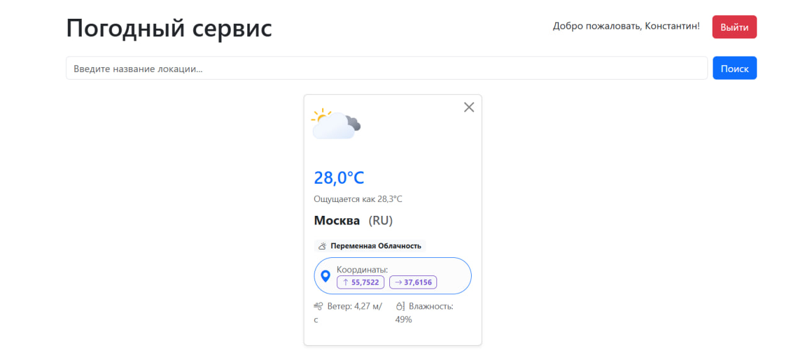
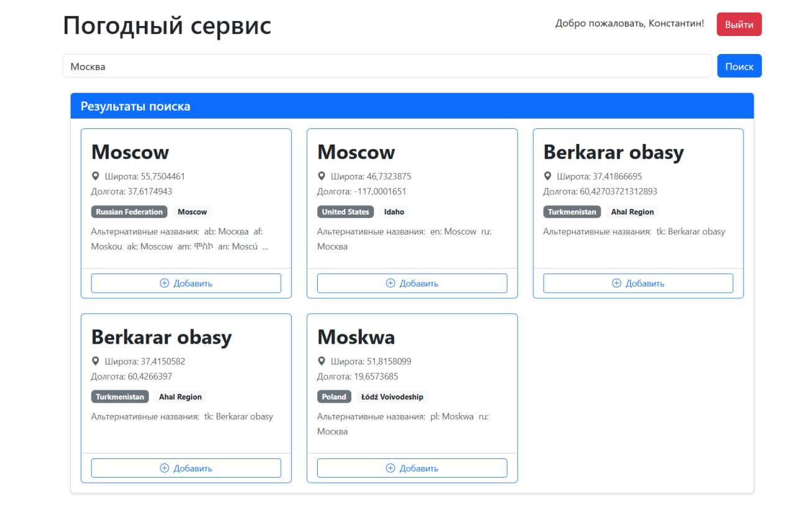
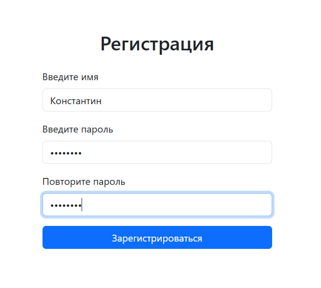

# Проект “Погода”
Веб-приложение для просмотра текущей погоды. Пользователь может зарегистрироваться и добавить в коллекцию один или несколько локаций (городов, сёл, других пунктов), после чего главная страница приложения начинает отображать список локаций с их текущей погодой.

[Техническое задание проекта](https://zhukovsd.github.io/python-backend-learning-course/finished-projects/projects/weather-viewer.md) (На момент 02.08.2026 удалено из списка)

## Скриншоты

### Главная страница


### Поиск


### Регистрация/ Авторизация


## Функционал приложения

Работа с пользователями:
- Регистрация
- Авторизация
- Logout

Работа с локациями:
- Поиск
- Добавление в список
- Просмотр списка локаций, для каждой локации отображается ...
- Удаление из списка
- Просмотр прогноза погоды (...)

## Варианты запуска приложения:


#### Через Docker

(Предполагается что Docker desctop установлен и запущен)

Создайте конфигурационный файл ".env", следуя образцу ".env.example"
Пример .env:
```
DJANGO_RUNSERVER_HIDE_WARNING=True

USE_REDIS=True
REDIS_URL="redis://127.0.0.1:6379/0"

DB_HOST="127.0.0.1"
DB_PORT=5435
DB_USER="root"
DB_PASS="password"
DB_NAME="main"

SECRET_KEY = '...'
OPENWEATHER_API_KEY = '...'
```

Запустите докер с помощью консоли:
```
docker-compose up --build
```

Теперь сайт будет доступен по адресу http://ваш_ip/

#### Django

Остальные варианты (локальный для разработки, тесты и пр.) осуществляется по стандартному пути библиотеки django

## Стек технологий

* Python
* Django 
* Pytest / unittest
* Redis
* PostgreSQL 

